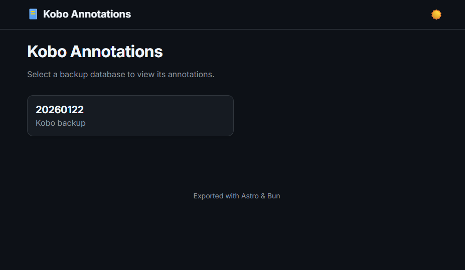
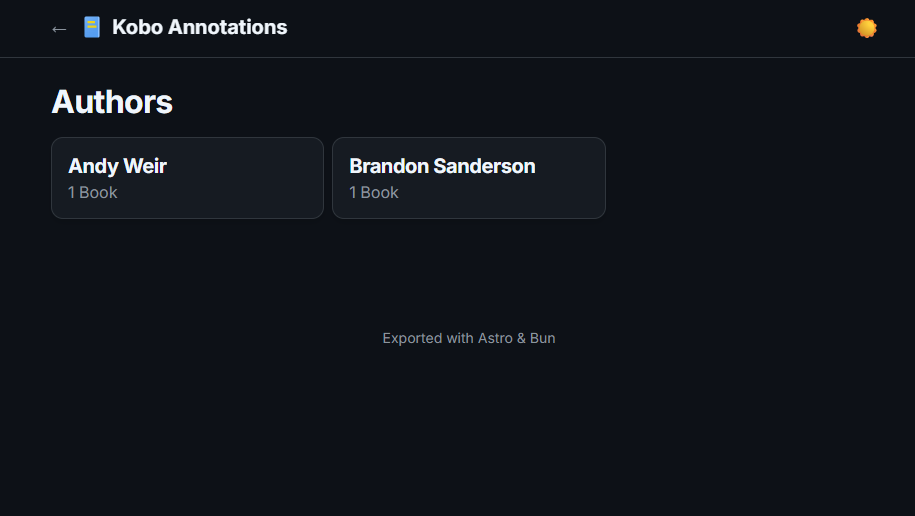
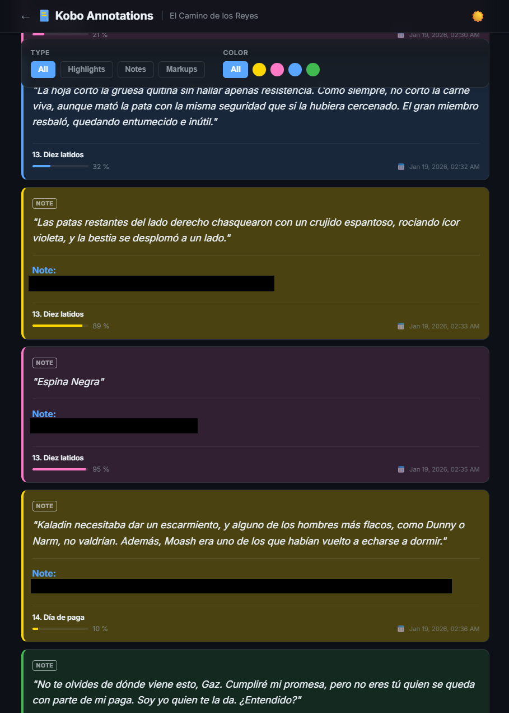
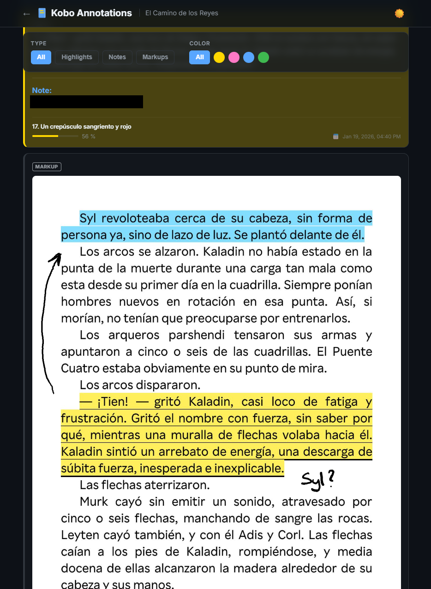
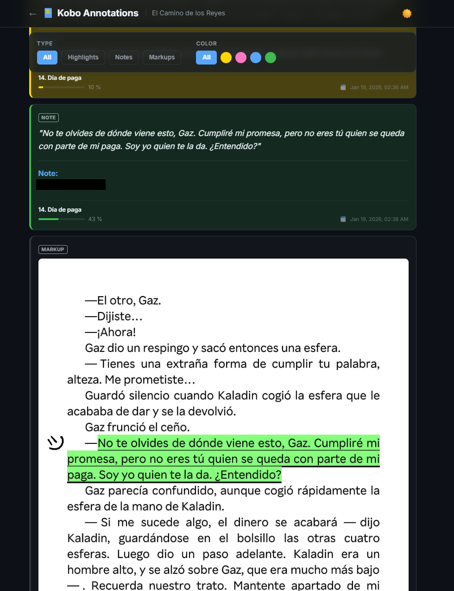

# 📚 Kobo Annotations Viewer

    

> A modern, local web viewer for your Kobo eReader annotations, capable of reading directly from the database without intermediate exports.

This project allows you to visualize your highlights and notes in a **premium interface** that respects the original context. It's built for speed and aesthetics.

---

## ✨ Key Features

- **⚡ On-Demand Reading**: Reads directly from multiple `KoboReader.sqlite` backups. No CSV/JSON export steps needed.
- **🗄️ Multi-Database Support**: Manage and browse multiple versions or backups of your Kobo library from a single interface.
- **📊 Detailed Metadata**: Displays annotation type, chapter progress with visual bars, and localized timestamps.
- **🎨 Visual Fidelity**: Accurately renders Kobo highlight colors (**Green**, **Blue**, **Pink**, **Yellow**).
- **✍️ Handwritten Markups**: Specialized support for Kobo Libra Colour handwritten annotations (SVG overlays over page screenshots).
- **🌗 Theme Switcher**: Includes a persistent **Light/Dark** mode toggle.
- **🔍 Advanced Search & Filtering**: Real-time search across highlights, notes, and chapters. Combine it with instant filters for type (Highlights, Notes, Markups) and original Kobo colors.
- **💎 Premium UI**: Modern aesthetic with **Glassmorphism** effects (sticky headers and filters), Inter typography, and responsive grid layout.
- **🚀 High Performance**: Powered by Bun's native SQLite driver and Astro's Server-Side Rendering (SSR).

## 📸 Screenshots

<details>
  <summary><b>Click to expand the visual gallery</b></summary>
  <br>

  <p align="center">
    <b>🗄️ Database & 👥 Author Selection</b><br>
    
    
  </p>

  <p align="center">
    <b>🖍️ Annotations & ✍️ Handwritten Markups</b><br>
    
    
  </p>

  <p align="center">
    <b>🌑 Dark Mode Aesthetics</b><br>
    
  </p>

</details>

## 🛠️ Tech Stack

This project is built with a modern, performance-first stack:

| Technology | Role | Why? |
| :--- | :--- | :--- |
| **[Astro](https://astro.build/)** | Web Framework | Dynamic SSR for real-time database access. |
| **[Bun](https://bun.sh/)** | Runtime & Package Manager | Instant startup and native SQLite support (`bun:sqlite`). |
| **[TypeScript](https://www.typescriptlang.org/)** | Language | Type safety for reliable database queries. |
| **[CSS Variables](https://developer.mozilla.org/en-US/docs/Web/CSS/Using_CSS_custom_properties)** | Styling | Flexible theming and **Glassmorphism** effects via `backdrop-filter`. |

## 🚀 Quick Start

### Prerequisites
- **[Bun](https://bun.sh/)** installed on your machine.

### Installation

1.  **Clone the repository**:
    ```bash
    git clone https://github.com/braispcastro/kobo-annotations-export.git
    cd kobo-annotations-export
    ```

2.  **Setup the `data` folder**:
    The project expects your backups inside the `data/` folder. Create a subfolder for each backup:
    ```text
    data/
      MyBackup_2026/
        KoboReader.sqlite
        markups/ (Optional: handwritten notes)
    ```

3.  **Install dependencies**:
    ```bash
    bun install
    ```

4.  **Run the viewer**:
    ```bash
    bun dev
    ```
    Open **[http://localhost:4321](http://localhost:4321)** to select a backup and browse your library.

---

## 📦 Building and Deployment

### 🏗️ Build (Windows)
Simply double-click the `build_site.bat` file in the project root.
*   ✅ Automatically builds the SSR application.
*   ✅ Prepares the `dist/` folder for deployment.
*   ✅ Creates an empty `data/` directory in the output for your backups.

### 🚀 Deploy (Raspberry Pi / Docker)
1.  Run `build_site.bat` on your Windows machine.
2.  Copy the **entire contents** of the `dist/` folder to your server (Raspberry Pi). This includes `Dockerfile`, `start-server.sh`, `package.json`, etc.
3.  Ensure you have Docker installed.
4.  Run the server on your Pi:
    ```bash
    chmod +x start-server.sh
    ./start-server.sh
    ```
    This builds/runs a optimized Bun container. The server will be active at port **8003**.
    Populate the `data/` folder on your server with your database backups to see them in the app.
